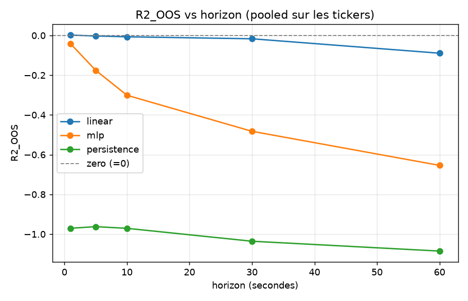
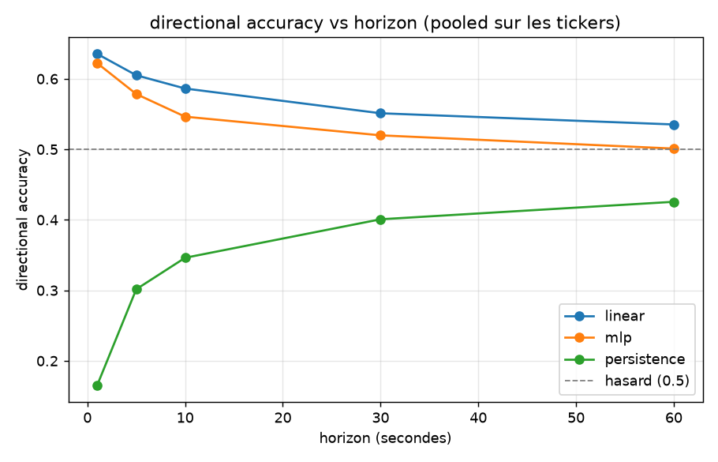

# Phase 0 - Un world model simple bat-il une baseline naïve, évalué honnêtement ?

> **TL;DR.** Sur 5 actions (LOBSTER, 2012-06-21), un modèle de séquence simple ne bat
> aucune baseline triviale en prédiction du rendement next-step du mid, à aucun horizon
> de 1 à 60 s (R²_OOS ≤ 0 partout) : verdict **NO-GO**.
> L'analyse fait apparaître une prédictibilité directionnelle (signe) réelle à très court
> terme, concentrée sur les actions large-tick (INTC, MSFT : ~80 % de bonne direction à
> 1 s), invisible dans l'erreur quadratique et située sous l'échelle du spread.
> Le résultat est confirmé par block bootstrap : le signe est significatif (IC 95 %
> excluant 0.5 sur INTC/MSFT/AMZN) mais le rendement net de coûts est négatif sur les
> 5 tickers - significatif n'est pas rentable.

---

## 1. Question

Un world model simple (MLP de séquence) prédit-il le log-rendement du mid-price à
l'horizon suivant mieux que des baselines naïves, en out-of-sample honnête
(anti-lookahead, walk-forward) ? Si non, c'est un résultat valide et documenté.

L'évaluation porte sur le marché passif, sans modéliser l'impact des ordres : l'action-
conditioning est repoussé en Phase 1. Aucune position, aucun trade - prédiction pure.

## 2. Données

Sample gratuit LOBSTER, journée du 2012-06-21, carnet reconstruit (NASDAQ).

| Ticker | Couverture | Niveaux | Barres 1 s |
|---|---|---|---|
| AMZN, GOOG, INTC, MSFT | journée 09:30–16:00 | 10 | ~23 400 |
| AAPL | 09:30–10:30 seulement | 10 (extrait d'un fichier L50) | ~3 600 |

Limites honnêtes : 1 seule journée, année 2012, 5 tickers. L'out-of-sample est donc
intraday (walk-forward sur fenêtres de la journée) ; aucune prétention à généraliser dans
le temps. AAPL ne couvre qu'1 h (seul échantillon disponible).

## 3. Protocole

Le protocole est figé avant tout entraînement et consigné dans
[`configs/phase0.yaml`](../configs/phase0.yaml) ; ce fichier n'a pas été modifié après
lecture des résultats.

- Barres clock-time 1 s ; cible = `log(mid_{t+h}) - log(mid_t)`.
- Features causales uniquement : imbalance par niveau (×10), profondeur, spread relatif,
  déviation micro-price, rendements passés laggés, OFI (order-flow imbalance). Chaque
  feature à `t` n'utilise que de l'information ≤ t.
- Walk-forward expansif purgé : train = passé, test = futur, 5 folds.
  Embargo = max(embargo, horizon) entre train et test, de sorte qu'une cible qui regarde
  `h` barres en avant ne peut pas fuiter dans le train.
- Standardisation fit sur le train seulement, appliquée au test.
- Baselines obligatoires : `zero` (prédire 0, soit le random walk / prix inchangé),
  `persistence` (rejouer le rendement passé sur `h` barres), `linear` (ridge sur les
  mêmes features).
- Métrique primaire pré-enregistrée : R²_OOS = `1 - SSE(modèle)/SSE(zero)`. `> 0` équivaut
  à battre « prédire 0 ». Métrique secondaire : directional accuracy (taux de bon signe).
- Tests anti-fuite automatisés ([`tests/test_no_lookahead.py`](../tests/test_no_lookahead.py)) :
  alignement cible=futur, embargo respecté, scaler train-only, pas de signal fantôme.

## 4. Résultats

Horizon sweep pré-enregistré sur le grid figé `{1, 5, 10, 30, 60}` s, tout reporté
(aucun cherry-pick). Valeurs pooled (moyenne sur tickers × folds).

> **Correction (2026-10-01).** La feature `ofi` de `build_features` soustrayait le côté
> ask au lieu de l'additionner : elle n'était correcte que tant que le prix ask ne bougeait
> pas. Le défaut est corrigé (`src/mirage/features.py`, commit `f9e6300`, non-régression
> dans `tests/test_ofi_causal.py`) et **tous les chiffres de cette section ont été
> recalculés**. L'effet est petit et de sens mixte - la directional accuracy du linéaire
> monte légèrement, son R²_OOS baisse un peu à 1 s, le MLP s'améliore marginalement - et
> le **verdict est inchangé**. Comparatif avant/après complet en §4.7.

### 4.1 R²_OOS - magnitude imprévisible à tous les horizons

| Horizon | linear | mlp | persistence | zero |
|---|---|---|---|---|
| 1 s | **+0.0007** | −0.039 | −0.971 | 0 |
| 5 s | −0.006 | −0.137 | −0.963 | 0 |
| 10 s | −0.011 | −0.268 | −0.971 | 0 |
| 30 s | −0.019 | −0.483 | −1.036 | 0 |
| 60 s | −0.091 | −0.662 | −1.085 | 0 |

Aucun modèle ne bat le zero-forecast : le meilleur (linéaire à 1 s, +0.0007) est ≈ 0 dans
le bruit et n'est pas significatif sans test dédié. Le MLP overfit et empire avec
l'horizon. La persistence est anti-prédictive (mean-reversion du bid-ask bounce). La
magnitude du rendement n'est pas prédictible.



### 4.2 Directional accuracy - un signal de signe réel, qui décroît proprement

| Horizon | linear | mlp | persistence |
|---|---|---|---|
| 1 s | **0.644** | 0.623 | 0.165 |
| 5 s | 0.609 | 0.586 | 0.302 |
| 10 s | 0.590 | 0.558 | 0.346 |
| 30 s | 0.552 | 0.514 | 0.401 |
| 60 s | 0.536 | 0.509 | 0.426 |

Le signe est prédictible mieux que le hasard à 1 s, et décroît régulièrement vers 0.5
quand l'horizon grandit. Cette décroissance lisse et physique constitue une preuve
comportementale de non-fuite (une fuite gonflerait toutes les échelles), en complément des
tests unitaires.



### 4.3 La structure masquée par la moyenne : large-tick vs small-tick

La moyenne poolée (0.644) masque une forte hétérogénéité. Détail à 1 s, modèle linéaire,
**moyenne sur les folds** :

| Ticker | dir_acc | R²_OOS | Prix moyen | Spread (ticks) | % temps à 1 tick | Régime |
|---|---|---|---|---|---|---|
| **INTC** | **0.830** | +0.021 | 27.04 $ | 1.01 | 98.8 % | large-tick |
| **MSFT** | **0.806** | +0.026 | 30.55 $ | 1.01 | 99.0 % | large-tick |
| AMZN | 0.575 | +0.004 | 222.76 $ | 12.86 | 0.2 % | small-tick |
| AAPL | 0.524 | −0.032 | 585.95 $ | 19.59 | 0.0 % | small-tick |
| GOOG | 0.487 | −0.014 | 570.68 $ | 27.36 | 0.0 % | small-tick |

Les colonnes `Prix moyen`, `Spread` et `% temps à 1 tick` ne dépendent pas des features et
sont inchangées par la correction.

> **Deux estimateurs, deux chiffres.** Les tables du §4.3 rapportent la **moyenne des
> folds**, celles du §4.4 l'**OOS poolé** ; les deux sont justes et ne diffèrent que de
> quelques millièmes (MSFT : 0.806 contre 0.800). Une version antérieure de ce rapport
> publiait 0.827/0.799 ici et 0.822/0.795 là sans nommer l'estimateur, ce qui se lisait
> comme une incohérence. Chaque tableau porte désormais le sien.

La prédictibilité directionnelle est entièrement portée par les actions large-tick
(INTC, MSFT : prix bas, spread collé à 1 tick ~99 % du temps). C'est un effet de
microstructure bien documenté : sur les large-tick stocks, le mid bouge peu et l'imbalance
du carnet prédit fortement le prochain micro-mouvement. Les small-tick (AMZN/GOOG/AAPL,
prix élevés, spread large) sont au niveau du hasard.

### 4.4 Significativité (block bootstrap) et coûts - significatif mais non rentable

Block bootstrap circulaire (blocs de 60 s, 2000 réplicats, respecte l'autocorrélation des
cibles chevauchantes) sur les prédictions OOS du modèle linéaire à 1 s, complété par une
analyse de coûts (stratégie « trade le signe », ~1 spread payé par retournement).
`scripts/bootstrap_signif.py`.

| Ticker | n OOS | dir_acc | IC 95 % | R²_OOS | IC 95 % | edge brut (bp/barre) | ½-spread (bp) | **net (bp/barre)** |
|---|---|---|---|---|---|---|---|---|
| INTC | 14 034 | 0.829 | [0.796, 0.860] | +0.031 | [0.018, 0.042] | 0.080 | 1.88 | **−0.45** |
| MSFT | 14 034 | 0.800 | [0.771, 0.829] | +0.030 | [0.020, 0.038] | 0.096 | 1.66 | **−0.30** |
| AMZN | 14 034 | 0.575 | [0.558, 0.591] | +0.005 | [0.002, 0.008] | 0.047 | 2.61 | **−0.93** |
| AAPL | 2 154 | 0.524 | [0.498, 0.549] | −0.028 | [−0.067, −0.005] | 0.012 | 1.49 | **−0.92** |
| GOOG | 14 034 | 0.489 | [0.471, 0.507] | −0.013 | [−0.019, −0.008] | 0.008 | 2.04 | **−1.10** |

- Statistiquement : le signe est significativement supérieur au hasard sur INTC, MSFT et
  AMZN - leur IC 95 % de dir_acc exclut 0.5 (p < 1e-3). GOOG est **au hasard** (IC
  [0.471, 0.507], p = 0.885) ; la version antérieure de ce rapport le donnait « sous le
  hasard », écart que la correction du signe de l'OFI a résorbé. AAPL reste non concluant :
  p = 0.037 mais IC contenant 0.5, **sur 6× moins d'échantillons** (1 h de session, §2) -
  les deux lectures du même bootstrap ne s'accordent pas, il est donc rapporté comme non
  tranché plutôt que classé dans un camp.
- Économiquement : l'edge directionnel brut (≤ 0.1 bp/barre) est des dizaines de fois plus
  petit que le demi-spread (1.5–2.6 bp). Le rendement net est négatif sur les 5 tickers.

« Significatif » n'est pas « rentable ». Un signe juste à 83 % qui perd de l'argent net de
coûts : le mirage, établi par deux méthodes indépendantes (IC bootstrap et coûts). Le
modèle de coûts est un proxy conservateur ; l'écart est trop grand pour qu'une exécution
plus fine l'inverse.

### 4.5 Contrôle non-linéaire : le GRU ne renverse pas le verdict

Un petit GRU (torch, séquences glissantes de 16 barres) tourne sur les mêmes données
(`scripts/run_gru.py`). Il fait marginalement mieux que le linéaire sur les large-tick
(INTC R²_OOS +0.030 vs +0.021, dir_acc 0.854 ; MSFT +0.029 vs +0.026) : la dynamique de
file d'attente large-tick a une part non-linéaire réelle. Deux réserves :

- **ces trois chiffres n'ont pas été recalculés après la correction de l'OFI** (§4.7) ; ils
  datent de la même exécution que les colonnes « avant » et sont donc à considérer comme
  non recontrôlés. Le verdict n'en dépend pas (règle §4.6 : 2/5 tickers, sans cohérence
  cross-sectional) ;

- il ne bat les baselines que sur 2/5 tickers (les large-tick), sans cohérence
  cross-sectional, ce qui déclenche le NO-GO par la règle pré-enregistrée ;
- c'est le même signal sous l'échelle du spread que le §4.4 a montré non rentable.

Un modèle plus expressif fitte un peu mieux le mirage ; il ne le transforme pas en edge.

### 4.6 Verdict

**NO-GO** pour « un world model simple bat les baselines en R²_OOS ».
Robuste sur 5 tickers × 5 horizons, et au passage MLP → GRU (§4.5). C'est un résultat
valide, pas un échec. **Reconfirmé après la correction du signe de l'OFI** : le MLP bat
`zero` sur 1/5 ticker (MSFT) et le linéaire sur 0/5, R²_OOS poolé du modèle < 0.

> Ce qui est prédictible : le **signe** du mid à très court terme sur les **large-tick**.
> Ce qui ne l'est pas : la **magnitude** du rendement, à toute échelle testée - et le
> signal directionnel ne survit pas à l'échelle du spread.

### 4.7 Effet de la correction du signe de l'OFI

Comparatif avant/après, même protocole, mêmes données, seule la feature corrigée change :

| Statistique | avant | après |
|---|---|---|
| R²_OOS poolé, linéaire à 1 s | +0.0017 | **+0.0007** |
| R²_OOS poolé, MLP à 1 s | −0.042 | **−0.039** |
| R²_OOS poolé, MLP à 5 s | −0.176 | **−0.137** |
| dir_acc poolée, linéaire à 1 s | 0.635 | **0.644** |
| dir_acc poolée, linéaire à 5 s | 0.605 | **0.609** |
| dir_acc INTC / MSFT (OOS poolé) | 0.822 / 0.795 | **0.829 / 0.800** |
| dir_acc GOOG | 0.474 (sous le hasard) | **0.489 (au hasard)** |
| net GOOG à 2 bp | −0.97 | **−1.10** |
| Verdict | NO-GO | **NO-GO** |

Lecture : l'effet est **petit et de sens mixte**. La directional accuracy monte partout de
+0.004 à +0.009 ; en regard, le R²_OOS du linéaire baisse un peu à 1 s, et le net de GOOG
se dégrade. Le classement qualitatif est intact - le signe reste prédictible surtout en
large-tick (~0.80–0.83), la magnitude reste non prédictible, et le net reste négatif sur
les 5 tickers. C'est cohérent avec l'OFI n'étant qu'une feature parmi une quinzaine : la
corruption ajoutait un terme anti-corrélé, sa correction rend le signal marginalement plus
propre sans changer sa nature.

**Le GRU (§4.5) n'a pas été re-exécuté** : il dépend de l'extra `[torch]` et sortait du
périmètre des commandes relancées. Les valeurs publiées (INTC R²_OOS +0.030, dir_acc 0.854)
restent donc **non recontrôlées** après correction ; elles ne participent pas au verdict.

## 5. Interprétation

L'écart entre les deux métriques est le résultat :

- le signe est prédit à ~80 % sur INTC/MSFT à 1 s ;
- mais R²_OOS ≈ 0.02 : la magnitude reste minuscule ;
- et le mouvement prévisible représente une fraction du spread (1 tick), qu'il faut
  traverser pour trader.

Un edge spectaculaire en statistique (83 % de bonne direction) est donc inexploitable net
de coûts : le gain directionnel est sous l'échelle du spread. C'est le phénomène de
model exploitation / mirage que l'évaluation vise à débusquer - ici dès la prédiction
pure, sans même un agent. Une métrique flatteuse (accuracy) est contredite par la métrique
économique (R² et coûts).

La suite porte sur un world model d'état (prédire l'évolution multi-features du carnet, et
non un scalaire) avec action-conditioning (impact des ordres), puis sur un test d'edge net
de coûts par un agent basé-modèle.

## 6. Limites

- 1 journée, 2012, 5 tickers : out-of-sample intraday uniquement.
- Cibles à horizon `h` chevauchantes, donc autocorrélées : traité par le block bootstrap
  circulaire du §4.4 (blocs de 60 s) pour les IC de significativité.
- AAPL ne couvre qu'1 h (échantillon plus court) : 2 154 observations OOS contre 14 034
  pour les autres, d'où un IC nettement plus large et une ligne non concluante au §4.4.
- Modèle de coûts simplifié (§4.4) : proxy conservateur « 1 spread par retournement ».
  L'écart edge/coût (des dizaines de fois) est trop grand pour qu'une exécution plus fine
  inverse le verdict, mais un backtest d'exécution réaliste reste un raffinement possible.
- Le §4.5 (GRU) n'a pas été recalculé après la correction de l'OFI (§4.7).

## 7. Reproduire

```powershell
py -3.11 -m venv .venv
.\.venv\Scripts\python.exe -m pip install -e ".[dev]"
# déposer les samples LOBSTER dans data/raw/ (voir data/README.md)
.\.venv\Scripts\python.exe -m pytest -q            # tests anti-fuite
.\.venv\Scripts\python.exe -m mirage.eval   --config configs\phase0.yaml   # éval @1 horizon
.\.venv\Scripts\python.exe -m mirage.sweep  --config configs\phase0.yaml   # horizon sweep + figures
.\.venv\Scripts\python.exe scripts\lobster\tick_regime.py        # régime tick par ticker
.\.venv\Scripts\python.exe scripts\lobster\bootstrap_signif.py   # significativité + coûts (§4.4)
.\.venv\Scripts\python.exe scripts\lobster\run_gru.py            # contrôle non-linéaire (§4.5, extra [torch])
```
