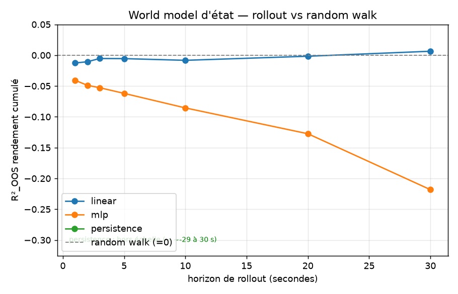

# Phase 1a - World model d'état passif : prédictibilité du prix et de la forme du carnet

> **TL;DR.** Un world model d'état passif prédit un vecteur d'état de 5 dimensions, déroulé
> en autorégressif, évalué en walk-forward purgé sur 5 tickers.
> Le prix reste un random walk : aucun modèle ne bat « le prix reste plat » à aucun horizon
> de 1 s à 30 s, et le MLP fait pire (R²_OOS −0.041 à 1 s, −0.218 à 30 s).
> La forme du carnet (spread, imbalance, profondeur, micro-price) est faiblement prévisible,
> mais linéairement seulement : R²_OOS 0.02–0.09 au pas suivant.
> Le MLP overfit et perd contre « no-change » sur les 4 dimensions de forme.
> Le non-linéaire n'apporte rien, même verdict que la Phase 0.

## 1. Question

Étant donné l'état du marché (vecteur compact de features de carnet), un world model simple
prédit-il l'état suivant mieux que des baselines naïves, en out-of-sample honnête ? Et
jusqu'à quel horizon sa prédiction du prix tient-elle avant de retomber au niveau d'un
random walk ?

La Phase 1a traite le marché passif, sans impact des ordres ; l'action-conditioning est
l'objet de la Phase 1b.

## 2. Données

- Sample LOBSTER, journée du 2012-06-21, carnet reconstruit (NASDAQ).
- 5 tickers : AAPL, MSFT, INTC, GOOG, AMZN ; les résultats sont poolés sur les 5.
- Barres de 1 s. Une seule journée : l'out-of-sample est intraday uniquement.

## 3. Protocole

Protocole figé dans [`configs/phase1.yaml`](../configs/phase1.yaml). Différences avec la
Phase 0 :

| | Phase 0 | Phase 1a |
|---|---|---|
| Sortie | 1 scalaire (return next-step) | vecteur d'état (5 dims) |
| Modèle | prédicteur | world model déroulable `(fenêtre d'états) → état suivant` |
| Éval | R²_OOS 1-step | R²_OOS par dimension + rollout (horizon de prédiction) |

- État (5 dimensions), borné, stationnaire et déroulable : `ret` (Δlog-mid), `spread_rel`,
  `imb1` (imbalance L1), `depth_imb` (L1..L10), `micro_dev`. Le modèle prédit l'état ;
  `ret` est cumulé pour reconstruire la trajectoire du prix.
- World model : `(16 derniers états) → état suivant`, multi-sorties. MLP par défaut
  (`mirage/wm.py`), déroulé en autorégressif pour le rollout.
- Baselines : `persistence` (l'état ne bouge pas = martingale), `mean`, `linear` (Ridge
  multi-sorties).
- Métrique 1-step : R²_OOS par dimension, contre la baseline naïve appropriée - random walk
  (0) pour `ret`, no-change pour les niveaux (spread, imbalance...). Walk-forward expansif
  purgé, embargo ≥ lookback, scaler fit train-only (dans les modèles).
- Métrique rollout : R²_OOS du rendement cumulé contre random walk (= 0), en fonction de
  l'horizon. C'est la figure principale du document.

## 4. Résultats

### 4.1 - 1-step, R²_OOS par dimension (pooled sur 5 tickers)

| Dimension | linear | mlp | mean | Lecture |
|---|---|---|---|---|
| `ret` (prix) | −0.012 | −0.041 | ~0 | imprévisible (random walk), confirme la Phase 0 |
| `spread_rel` | +0.076 | −0.161 | −2.7 | forme prévisible linéairement ; MLP overfit |
| `imb1` | +0.091 | −0.007 | −3.2 | idem |
| `depth_imb` | +0.017 | −0.703 | −15 | idem (MLP overfit fort) |
| `micro_dev` | +0.089 | −0.014 | −3.0 | idem |

- Le MLP ne bat la baseline sur aucune dimension : il overfit partout.
- Le linéaire bat « no-change » sur les 4 dimensions de forme (R² 0.02–0.09), pas sur le prix.
- `mean` est catastrophique sur les niveaux : ces quantités sont autocorrélées, et
  « no-change » l'emporte largement sur la moyenne.

### 4.2 - Rollout : R²_OOS du rendement cumulé vs random walk



| Horizon | linear | mlp | persistence |
|---|---|---|---|
| 1 s | −0.013 | −0.041 | −1.01 |
| 5 s | −0.006 | −0.062 | −4.91 |
| 10 s | −0.008 | −0.086 | −9.75 |
| 20 s | −0.002 | −0.127 | −19.4 |
| 30 s | +0.006 | −0.218 | −29.2 |

- Aucun modèle ne bat le random walk sur la trajectoire de prix, à aucun horizon.
- Le linéaire reste proche de 0 (random walk). Le MLP diverge : l'erreur se compose en
  rollout (−0.04 → −0.22). La `persistence` est catastrophique : rejouer le dernier return
  cumule l'anti-corrélation, jusqu'à −29 à 30 s.

## 5. Interprétation

Le world model d'état passif est honnêtement faible : le prix est un random walk, la forme
du carnet n'offre qu'un filet de prédictibilité linéaire. Le modèle sépare deux régimes.

- Le prix est un random walk, invisible au world model à toute échelle. Un modèle plus
  expressif (MLP) aggrave la prédiction en rollout, par composition de l'erreur. C'est
  cohérent avec la Phase 0 : la magnitude des rendements n'est pas prédictible.
- La forme du carnet (spread, imbalances, micro-price) présente une structure linéaire
  ténue au pas suivant, capturée par un Ridge et pas par le MLP, qui overfit.

Un world model utile prédirait donc surtout la dynamique de forme du carnet, faiblement et
linéairement, pas le prix. Le non-linéaire n'apporte rien : même verdict anti-mirage que la
Phase 0, transposé au monde multi-dimensionnel. Le résultat est valide, cohérent et
documenté : il établit ce qui est prédictible (un peu la forme) et ce qui ne l'est pas (le
prix).

## 6. Limites

- Une seule journée, 2012, 5 tickers : out-of-sample intraday uniquement, comme en Phase 0.
- État compact (5 dimensions), première étape volontairement simple. L'extension
  (top-of-book élargi, L10) est une suite naturelle si la forme se révèle plus riche.
- MLP seul comme world model non-linéaire. Un GRU multi-sorties est une variante possible,
  mais le MLP overfit déjà, ce qui laisse peu d'espoir qu'un modèle plus gros aide ici.
- L'impact des ordres n'est pas traité ici, et n'est pas testable sur données historiques :
  il n'existe aucun contrefactuel (« ce que le carnet aurait fait sans l'ordre »). L'overlay
  d'impact de la Phase 1b est donc mécaniste (consommation du carnet plus un impact
  temporaire décroissant), documenté et sanity-checké ; sa validation réelle passe par
  ABIDES (Stage 2), où la vérité-terrain existe. C'est précisément pourquoi le model
  exploitation est un risque, et pourquoi il est mesuré en simulateur.

## 7. Reproduire

```powershell
.\.venv\Scripts\python.exe -m pytest -q                    # inclut le test état/rollout
.\.venv\Scripts\python.exe -m mirage.wm_eval --config configs\phase1.yaml
```
