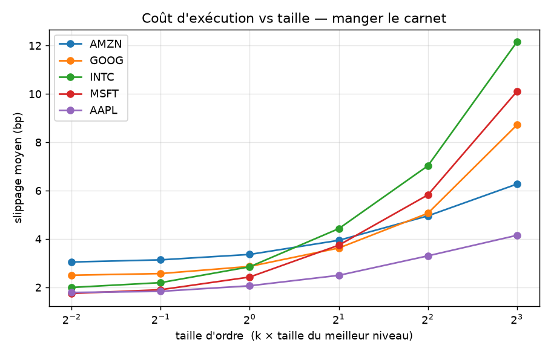
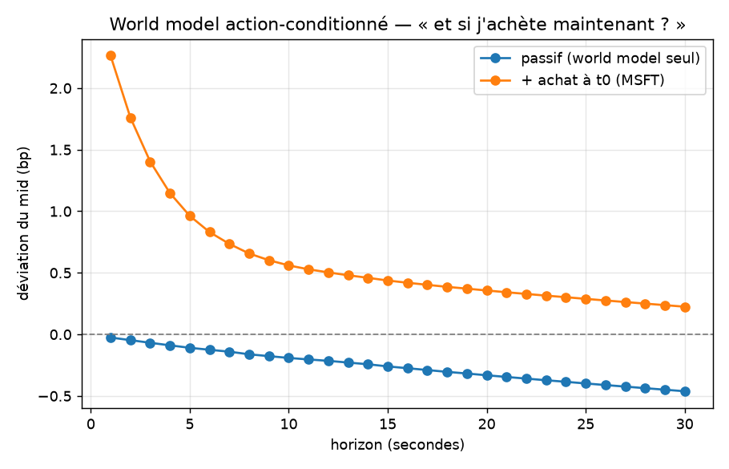

# Phase 1b — Action-conditioning : impact des ordres propres

> **TL;DR.** Le world model devient action-conditionné : état suivant = évolution passive
> (Phase 1a) + impact de l'ordre.
> L'impact a une partie mécanique, mesurable sur le vrai carnet — un ordre mange les
> niveaux, et le slippage comme le saut de mid sont calculés exactement — et une dynamique
> de décroissance modélisée, faute de contrefactuel sur l'historique.
> Le coût du plus petit ordre est de 1.7–3 bp (le demi-spread) et monte à 8–12 bp avec la
> taille.
> L'edge directionnel prédictible mesuré en Phase 0 est ≤ 0.1 bp par barre, soit un ratio
> coût / edge de 17 à 30 : le mirage est confirmé côté exécution, sur données réelles.

## 1. Question

Comment un ordre propre déforme-t-il l'état futur du carnet, et dans quelle mesure cette
déformation est-elle mesurable sur données historiques ?

Deux parties se distinguent.

- Mesurable, sur le vrai carnet LOBSTER : l'exécution d'un ordre au marché, c'est-à-dire
  les niveaux consommés, le prix obtenu et le saut de mid immédiat. Déterministe, ancré sur
  le réel.
- Non mesurable, faute de contrefactuel : la dynamique après le trade (part permanente
  contre part temporaire, décroissance). Elle prend la forme d'une paramétrisation
  documentée, dont la validation est déférée à ABIDES (Stage 2).

Le périmètre est limité aux ordres au marché, cas simple et déterministe. Code :
`mirage/impact.py`.

## 2. Données

- Sample LOBSTER, journée du 2012-06-21, carnet reconstruit (NASDAQ).
- 5 tickers : AAPL, MSFT, INTC, GOOG, AMZN.
- Ordres au marché uniquement. Le slippage est évalué out-of-sample sur la journée, ticker
  par ticker.

## 3. Protocole

Un achat de `q` actions consomme les asks niveau par niveau : le prix d'exécution est le
VWAP des niveaux mangés, le meilleur ask remonte et le mid saute. Tout est calculé sur le
vrai carnet.

Tests de sanité ([`tests/test_impact.py`](../tests/test_impact.py)) : un ordre minuscule
paie le demi-spread sans bouger le mid ; vider un niveau pousse le mid ; le slippage croît
avec la taille ; un ordre supérieur à la profondeur visible n'est pas rempli.

## 4. Résultats

### 4.1 — Courbes de coût (mesurable)

Slippage moyen (bp) pour acheter une taille `q = k × (taille du meilleur niveau)`,
out-of-sample sur la journée, par ticker :

| k × L1 | AAPL | MSFT | INTC | GOOG | AMZN |
|---|---|---|---|---|---|
| 0.25 (minuscule) | 1.79 | 1.75 | 2.00 | 2.50 | 3.05 |
| 1.0 | 2.06 | 2.43 | 2.85 | 2.86 | 3.36 |
| 4.0 | 3.30 | 5.82 | 7.03 | 5.06 | 4.95 |
| 8.0 | 4.15 | 10.10 | 12.15 | 8.72 | 6.27 |



- Le plus petit ordre paie déjà environ 1.7–3 bp, soit le demi-spread mesuré en Phase 0.
- Le coût monte vite avec la taille, par consommation du carnet.
- Le fill-rate s'effondre sur les small-tick : à 8×L1, GOOG n'est rempli qu'à 15 %, AAPL à
  55 % ; leurs carnets sont fins, ce qui interdit de trader gros. Les large-tick (INTC/MSFT)
  ont des carnets profonds mais coûtent quand même 10–12 bp à 8×L1.

### 4.2 — Verrou anti-mirage

| | valeur | source |
|---|---|---|
| Edge directionnel prédictible | ≤ 0.1 bp / barre | cf. §4.4 de PHASE0.md |
| Coût du plus petit ordre | 1.7 – 3 bp | Phase 1b (ce document) |
| Ratio coût / edge | × 17 à × 30 | — |

Le signal ne peut pas être monétisé : le franchir une seule fois coûte 20–30 fois ce qu'il
rapporte, et trader plus gros coûte encore plus, sans même être rempli. Le mirage de la
Phase 0 est donc établi côté exécution, sur le vrai carnet.

### 4.3 — World model action-conditionné

`état suivant = évolution passive (Phase 1a) + impact de l'ordre`. Démonstration sur MSFT,
pour un achat de 2×L1 :



- Sans ordre (passif) : le mid reste quasiment plat, conformément au résultat de la Phase 1a
  (random walk).
- Avec l'ordre : le mid saute de ~2.3 bp immédiatement, puis décroît vers sa part permanente
  (~0.7 bp). Le world model répond à une action.

## 5. Interprétation

Le coût d'exécution domine l'edge directionnel d'un facteur 17 à 30 sur données réelles.
Cette conclusion est établie côté exécution, directement sur le carnet, et non par un
modèle.

L'étape suivante (Stage 2, ABIDES) apporte un impact natif : le simulateur connaît la
vérité-terrain, ce qui permet de calibrer et valider la dynamique d'impact, d'entraîner et
de planifier un agent basé-modèle, puis de mesurer l'écart entre l'edge dans le modèle et
l'edge en simulation. Cet écart est la mesure directe du model exploitation.

## 6. Limites

- Une seule journée, 2012, 5 tickers ; ordres au marché uniquement (pas d'ordre limit, pas
  de file d'attente).
- La décroissance d'impact est une hypothèse : l'immédiat est mesuré, la dynamique est
  modélisée.
- Pas de file d'attente, pas de latence, pas d'impact croisé entre ordres.
- La trajectoire post-trade, `impact_h = immédiat × [permanent + (1-permanent)·decay^h]`,
  repose sur deux hypothèses (`permanent_frac`, `decay`) non calibrables sur l'historique,
  faute de contrefactuel. L'immédiat (saut de mid) est mesuré, la décroissance est posée. La
  validation passe par ABIDES (Stage 2), où le processus réel est contrôlé et où l'on peut
  comparer « avec » et « sans » ordre. C'est le terrain du model exploitation : un agent qui
  exploiterait une décroissance mal calibrée gagnerait dans le modèle, pas en réel.

## 7. Reproduire

```powershell
.\.venv\Scripts\python.exe -m pytest -q                 # inclut tests/test_impact.py
.\.venv\Scripts\python.exe scripts\impact_curves.py     # courbes de coût + démo action
```
